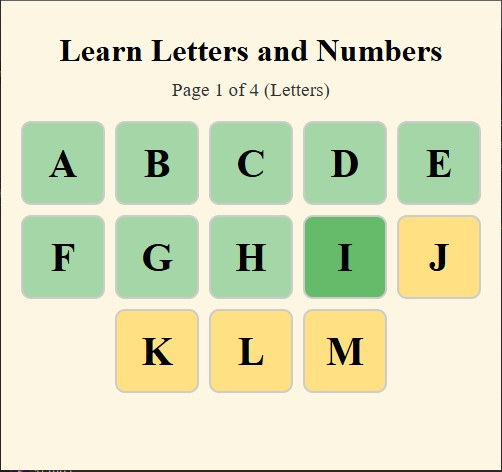

# 🧠 Interactive Educational Game

**Interactive Educational Game** is a lightweight and user-friendly web app built with **Python + Flask**, designed for children in the early stages of literacy. It presents letters and numbers with pronunciation in English, promoting fun and interactive learning through visuals and audio.

---

## 🌐 Live Demo

You can access and test the game directly at:

👉 [https://game.valega.dev](https://game.valega.dev)

---

## 🌍 Available Languages

- 🇧🇷 [Versão em Português](https://github.com/jorgevalega/jogo-educativo)
- 🇪🇸 [Versión en Español](https://github.com/jorgevalega/juego-educativo)
- 🇺🇸 English – *You are here*

---

## 🚀 Features

- ✅ Display of **uppercase and lowercase letters**, grouped by pages
- 🔢 Numbers from **0 to 100**, divided didactically (0–10, 11–20, ...)
- 🔊 Audio playback for each letter and number
- 🏅 Positive feedback with **medal and congratulations audio**
- 📱 Responsive interface for mobile, tablet, and desktop
- 🔄 Automatic page navigation (no buttons needed)
- 🎉 Animated ending and option to restart

---

## 📸 Screenshots




---

## 🛠️ Installation

**1. Requirements**  
Make sure you have **Python 3.8 or higher** installed on your system.

**2. Clone the repository**

```bash
git clone https://github.com/jorgevalega/educational-game.git
cd educational-game
```

**3. Create and activate a virtual environment (recommended)**

```bash
python -m venv venv
source venv/bin/activate       # Linux/macOS
venv\Scripts\activate          # Windows
```
**4. Install dependencies**

```bash
pip install -r requirements.txt
```

---

## ▶️ How to Use

**1. Run the application locally:**

```bash
python app.py
```

**2. Open your browser and go to:**

```bash
http://localhost:5000
```

**3. Click on the letters or numbers to hear their pronunciation.**
After completing a page, a medal will appear with a congratulations sound, and the app will automatically move to the next page.

---

## 📁 Folder Structure

```bash
educational-game/
├── app.py
├── requirements.txt
├── static/
│   └── audio/
│       ├── A.mp3
│       ├── 1.mp3
│       └── congratulations.mp3
├── templates/
│   └── index.html
├── assets/
│   ├── game.jpg
│   └── congratulations.jpg
└── README.md
```

---

## 🧾 Dependencies

- `flask` — Lightweight and powerful web framework for Python
- `gtts` (optional) — Used to generate .mp3 audio files (Google Text-to-Speech)

All required dependencies are listed in [`requirements.txt`](requirements.txt).

---

## 🧑‍💻 Author

Developed by [Jorge Valega](https://github.com/jorgevalega) – passionate about automation, accessibility, and educational tools for children and families.

---

## 📄 License

This project is licensed under the [Licença MIT](LICENSE).

---

## ☕ Support the Project

If this game was helpful for you or your family, leave a ⭐ on GitHub or share it with teachers and friends!
